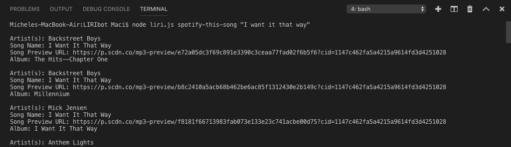
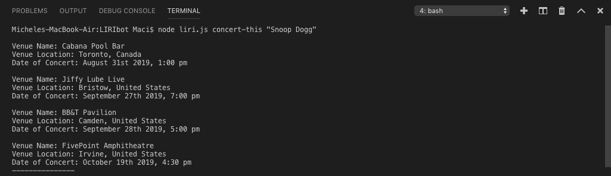
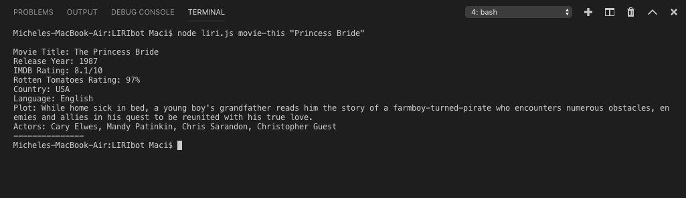
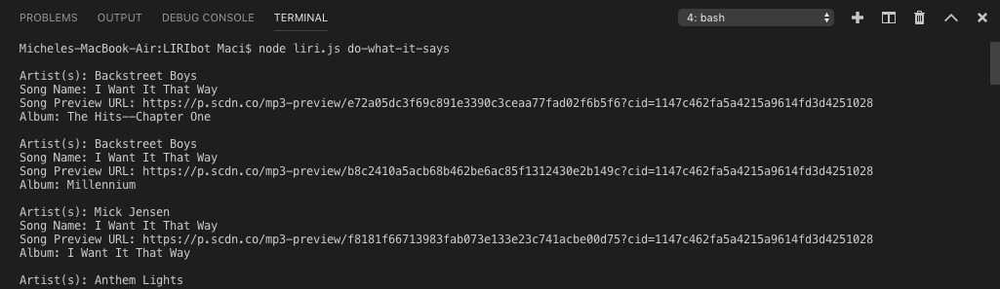

 ## What is LIRIbot and a quick overview:

LIRIbot is a Language Interpretation and Recognition Interface that is used to hep with returning information on songs, movies and concert information on bands that are touring. 

It helps condense a lot of information into one easy to use command line application. This smart bot uses two different kind of calls to return information. I used Axios which is a promise based HTTP client for node.js as well as the spotify NPM. 
 
## LIRIbot can perform the following actions:
```”concert-this”``` 
An action that lets you see tour dates and locations for a band such as:
* Venue Name
* Venue Location
* Date of Concert

```"spotify-this-song"```
An action that returns song information from spotify for a search term of your choice, including:
* Artist(s)
* Song name
* Song preview URL
* Album

```"movie-this"```
An action that returns information from OMDb on a movie of your choice, including:
* Movie Title
* Release year
* IMDb Rating
* Rotten Tomatoes Rating
* Country
* Language
* Plot

```"do-what-it-says"```
This action will run the action specified in the file random.txt and return the information for any of the actions above.
 
## Looking at the code:
* **liri.js:** All the main functionality of the app. The entry point for the application.
* **.gitignore:** File which instructs git to ignore the files contained in it
* **key.js:**  A module that loads the spotify API keys from the environment and is used by liri.js
* **package.json**: NPM information and dependencies

 
## Unpacking liri.js:
The application is divided into three sections
* First Section: Requiring our modules and identifying the "operation" and "searchTerm"
    * "operation" ==> the action specified in the command line (spotify-this, etc.)
    * "searchTerm" ==> what we are searching for ("Backstreet Boys", "Forrest gump", etc.)

* Second Section: There are two functions for each operation, one to call the API and one to parse the response and display it
    * ```getMovieDetails()```
    * ```parseMovieResponse()```
    * ```getBandDetails()```
    * ```parseBandResponse()```
    * ```getSongDetails()```
    * ```parseSpotifyResponse()```

* Third Section: This section identifies what action is required to be taken based on the command line input, and calls the respective function.
 
## Start to Finish:
Here's how you can use LIRIbot!

1. Search for Tour Dates:
    ```node liri.js concert-this "Snoop Dogg"```
    What to expect:

2. Search for song details:
    ```node liri.js spotify-this-song "I want it that way"```
    What to expect:

3. Search for movie details:
    ```node liri.js movie-this "Princess Bride" ```
    What to expect: 

4. File input:
    ```node liri.js do-what-it-says```
    What to expect: 



Designed and developed by: Maci Slenes
